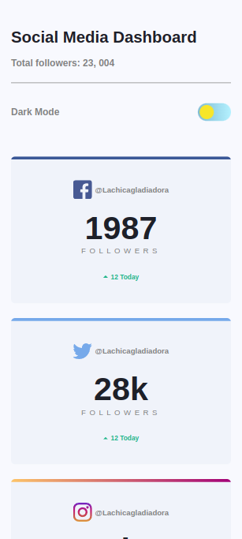
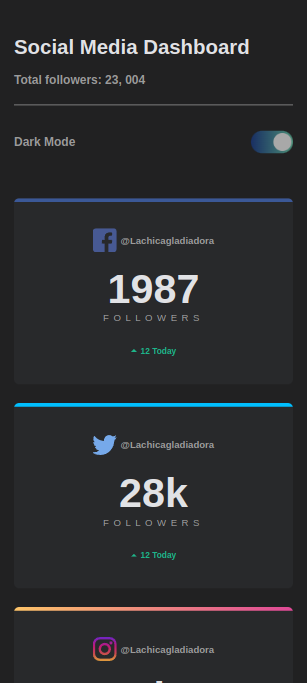

# Social Media Dashboard

View ["Social Media Dashboard"](https://lachicagladiadora.github.io/dashboard-project-html-css/)

Web project in Vite with HTML, CSS and some lines of JavaScript.
Responsive layout and design practice that includes dark mode and light mode with JavaScript logic.

## Desktop

## Tablet

## Mobile

# How to run

1. Clone this repository.
2. Run `npm install` to install the dependencies.
3. Run `npm run dev` to run the server so you can enjoy the viewing.
